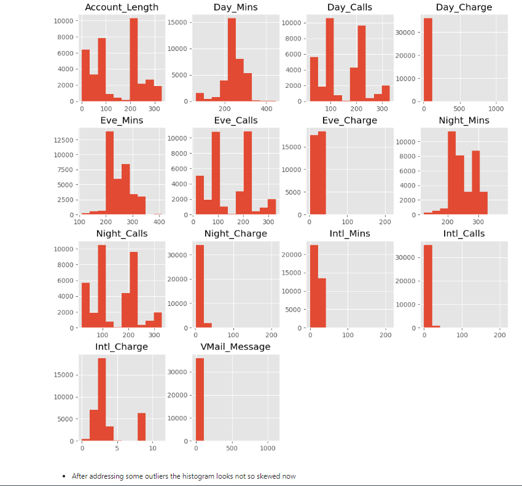

# A Data Analysis Project

## Overview

A comprehensive data analysis on the telecom customer churn [dataset](#dataset) carried out as part of an interview process.

Screenshots of the key steps were shown in the Sub-Headings, for the entire code with all the steps carried out do check out the jupyter notebook files.

## Table of Contents

- [Requirements](#requirements)
- [Dataset](#dataset)
- [Order of Procedure](#order-of-procedure)
- [Exploratory Data Analysis](#eda)
- [Clustering](#clustering)
- [Predictive Model](#predictive-model)
- [Contributing](#contributing)
- [License](#license)

## Requirements

The dependencies or packages required for the project are specified in the requirements file.

    pip install -r requirements.txt

The entire process is carried out in notebook files (`.ipynb`).

## Dataset

- **Source**: [Link to the data source](https://www.kaggle.com/datasets/anshulmehtakaggl/cdrcall-details-record-predict-telco-churn)
- **Format**: CSV file.
- Oh and it's also included in this repo itself.

## Order of Procedure
1. **Data Cleaning**: Begin by cleaning the data, removing any duplicates and outliers.
2. **Data Standardization**: Standardize the cleaned data to ensure consistency across all features.
3. **Dimensionality Reduction**: Perform dimensionality reduction (DR) on the standardized data to reduce complexity.
4. **Clustering**: Apply clustering techniques to the dimensionally reduced data for analysis.

## EDA

- **Data Head**: 
    - Taking a look at how the data is...
- **Data Info**: 
    - Checking the datatypes of the features present (Note:- Object is just string)
- **Descriptive Statistics**: 
- **Inference**: 
    - looking at the descriptive statistics these inference could be made
- **Handling NaN and Duplicates**: 
    - Checking for Null/NaN values
- **Confirming Duplicates manually**: 
    - Manually checking if the duplicates with the help of query function
- **Removing Duplicates**: 
    - Addressing the duplicates by removing them
- **Box Plot After Removing Duplicates**: 
    - Looking at the boxplot after removing dupes
- **Manual Outlier Check**: 
    - Investigating outliers for potentital impossible values
- **Addressing Outliers**: 
    - Removing outliers with the help of iqr method (function as defined above) on the selected numerical features
- **Box Plot After Outlier Removal**: 
- **Histogram After Cleaning**: 
    - After addressing dupes & outliers looking at histogram for skewness in the distribution
- **Correlation Heatmap**: 

## Clustering

Need to add in between comments

- **Standardizing data before performing clustering**: 
- **Splitting df on 'Churn' feature**: 
- **Clustering then Dimensionality Reduction**: 
    - Performed clustering first before DR in hopes to find any complex cluster groups/patterns but all it ended up doing was take a lot of time to run nonetheless.
- **Dimensionality Reduction then Clustering**: 
    - Optimal approach
- **Silhouette Score**: 
    - And so after seeing the different clustering choices from earlier, Hierarchical and KMeans seem to produce the best results. And so in order to find the optimal clusters I used the Silhouette score method.
- **Optimized Clustering**: 
- **K-Means vs Hierarchical Clustering**: 
- **K-Means Clustering Results on entire df**: 
- **Validating Churn rate in each cluster**: 
- **K-Means Cluseting on Churn True**: 
- **K-Means Clustering on Churn False**: 

## Predictive Model
### Building a predictive model on the entire df using ML algorithms for future steps
- **Predictive Models Overview**: 
    - Didn't explore Neural Netowrks as the dataset size reduced to 36k from 110k ish after addressing dupes and outliers which could be easily handled by ML algs itself.
    - Above pic shows the models and their eval metrics.
- **Saving Model**: 

## Contributing

- As per the LICENSE feel free to use it and if you want to add on to this or rectify any mistakes I've made (I'm fairly new to this), you can do so by submitting a pull request. 

## License

This project is licensed under the MIT License - see the [LICENSE](LICENSE) file for details.
